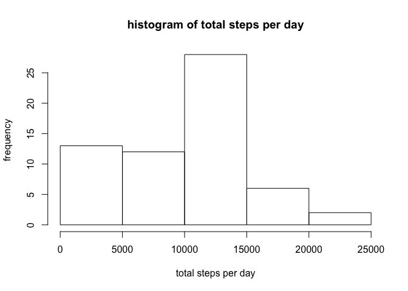
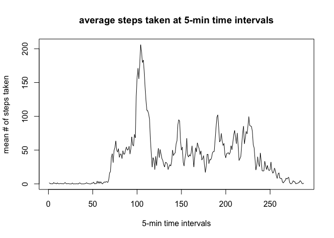
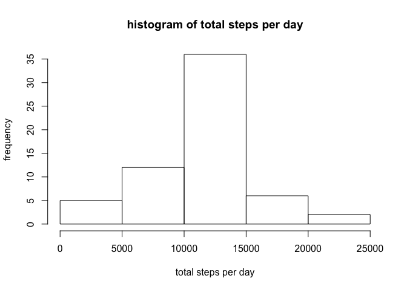
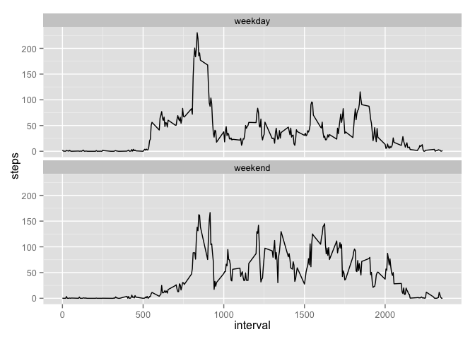

Loading and preprocessing the data
----------------------------------

    fileName <- "activity.zip"
    fileNameCSV <- gsub("zip", "csv", fileName)

    unzip(fileName, fileNameCSV)
    data <- read.csv(fileNameCSV, header=TRUE, sep=",", na.strings="NA")
    summary(data)

    ##      steps                date          interval     
    ##  Min.   :  0.00   2012-10-01:  288   Min.   :   0.0  
    ##  1st Qu.:  0.00   2012-10-02:  288   1st Qu.: 588.8  
    ##  Median :  0.00   2012-10-03:  288   Median :1177.5  
    ##  Mean   : 37.38   2012-10-04:  288   Mean   :1177.5  
    ##  3rd Qu.: 12.00   2012-10-05:  288   3rd Qu.:1766.2  
    ##  Max.   :806.00   2012-10-06:  288   Max.   :2355.0  
    ##  NA's   :2304     (Other)   :15840

What is mean total number of steps taken per day?
-------------------------------------------------

Get the total number of steps take per day

    totalSteps <- tapply(data$steps, data$date, FUN=sum, na.rm =TRUE)

Make a histogram of the total number of steps taken each day

    hist(totalSteps, xlab="total steps per day", ylab="frequency", main="histogram of total steps per day")

<!-- -->

Calculate the mean and median of the total number of steps taken per day

    mean(totalSteps, na.rm=TRUE)

    ## [1] 9354.23

    median(totalSteps, na.rm=TRUE)

    ## [1] 10395

What is the average daily activity pattern?
-------------------------------------------

Time series plot of the 5-minute interval (x-axis) and the average
number of steps taken, averaged across all days (y-axis)

    meanSteps <- tapply(data$steps, data$interval, FUN=mean, na.rm = TRUE)
    plot(meanSteps, type="l", 
         xlab="5-min time intervals", 
         ylab="mean # of steps taken", 
         main="average steps taken at 5-min time intervals"
    )

<!-- -->

Get 5-minute interval, on average across all the days in the dataset,
containing the maximum number of steps?

    positionOfMax <- which.max(meanSteps)
    names(positionOfMax)

    ## [1] "835"

Imputing missing values
-----------------------

There are a number of days/intervals where there are missing values
(coded as NA). The presence of missing days may introduce bias into some
calculations or summaries of the data.

1.  Calculate and report the total number of missing values in the
    dataset

<!-- -->

    sum(is.na(data$steps))

    ## [1] 2304

1.  As a strategy for filling in all of the missing values in the
    dataset we use the mean for that 5-minute interval.

2.  Create a new dataset that is equal to the original dataset but with
    the missing data filled in.

<!-- -->

    for(i in 1:length(data$steps)){
      if(is.na(data[i,1])){
        data[i,1] <- unname(meanSteps[toString(data[i,3])])
      }
    }

1.  Make a histogram of the total number of steps taken each day and
    Calculate and report the mean and median total number of steps taken
    per day.

<!-- -->

    totalSteps <- tapply(data$steps, data$date, FUN=sum, na.rm =TRUE)
    hist(totalSteps, xlab="total steps per day", ylab="frequency", main="histogram of total steps per day")

<!-- -->

    mean(totalSteps, na.rm=TRUE)

    ## [1] 10766.19

    median(totalSteps, na.rm=TRUE)

    ## [1] 10766.19

Values are higher than thoes calculate in the first part of the
assighnment since the NA values tend to shift the results towards lower
values.

Are there differences in activity patterns between weekdays and weekends?
-------------------------------------------------------------------------

1.  Create a new factor variable in the dataset with two levels –
    “weekday” and “weekend” indicating whether a given date is a weekday
    or weekend day.

<!-- -->

    for(i in 1:length(data[,1])){
      name = weekdays(as.Date(data$date[i]))
      if (name == "Saturday" | name == "Sunday"){
        data$category[i] <- "weekend"
      } else {
        data$category[i] <- "weekday"
      }
    }
    data$category <- as.factor(data$category)

1.  Make a panel plot containing a time series plot of the 5-minute
    interval (x-axis) and the average number of steps taken, averaged
    across all weekday days or weekend days (y-axis).

<!-- -->

    library(ggplot2)
    library(plyr)
    tmpdata <- ddply(data, .(interval,category), summarize, steps = mean(steps, na.rm=TRUE))
    ggplot(data=tmpdata, aes(x=interval, y=steps, group=category)) + geom_line()+ facet_wrap(~ category, nrow=2)

<!-- -->

In the moring hours until around 8am there is more activity on the
weekdays, whereas in the afternoon there is more activity on the
weekend.
